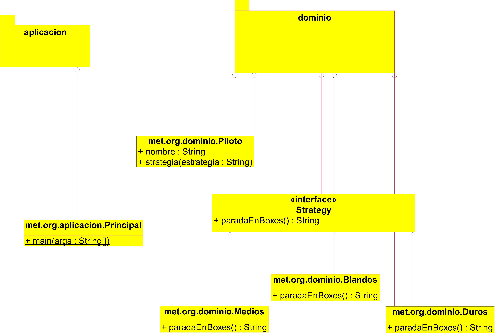

# Patrones de Comportamiento

### ESTE TRABAJO EXPONE COMO USAR EL PATRON DE ESTRATEGIA O STRATEGY

### Análisis y descripción del proyecto

### DIAGRAMA DEL CÓDIGO

## Realizado por:

-Jesús Joana Azuara
-Alejandro Ramírez Larena
-Carlos Ramos Rial
